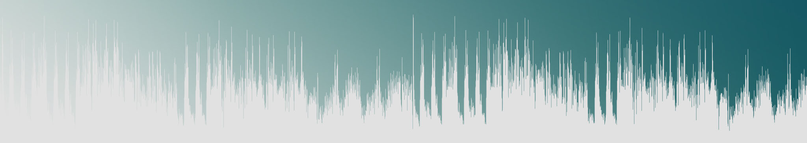

<h1 align="center">Alex R Winter: Post Production Sound</h1>

<a href="https://sophie-apples.github.io/alexrwinter/">VIEW LIVE DEMO</a>

<em>Summary This is a professional website for a self-employed Sound Designer/Editor working mainly for film and TV.
The fundamental purpose of the website is to encourage potential collaborators and clients to make contact and to establish an online presence.</em>

<h2>Strategy Plane</h2>

<h3>Business Objectives</h3>
- Promote the service provided (i.e.post production sound) 
- Get more employment and collaborative opportunities 
- Create professional connections by encouraging clients to make contact 
- Clearly display the credentials of Alex Winter in his field 
- Give a clean, modern, professional image/brand 

<h3>Client Objectives</h3>
- Looking for a sound editor for their project, or working in a related field looking for contacts 
- Clear information about what services are provided 
- Find out the credibility of individual/ service 
- Get a sense of who this person is (a personable yet professional image: someone they want to work with or know professionally) 
- Easy to contact and easy to connect with online (esp. LinkedIn) 

<h3>B2B Strategy</h3>

B2B rather than B2C: Visitors will not be purchasing anything on the website, and most likely not contacting for a quote on the first visit; instead they will be researching possible collaborators for a specific project, or looking for networking opportunities for future collaborations. They will want to use a service which is professional and reliable. They will want to see that this person is an expert in their field.

<h3>User stories</h3>
-	‘I want to know about this person’s experience and what other projects they have worked on.’ 
-	‘I want to get an impression of whether they are friendly and professional and see if they are someone I want to work with.’ 
-	‘I want to be able to contact them easily.’ 
-	‘I want the website to be easy to navigate and the information to be relevant.’ 

<h2>Scope/ Structure</h2>

<u>Sections to be included & rationale:</u> 
- Landing section: title to give clear message, contact callout button to address central purpose of site, hero image which represents the industry. 
- About section: articulate the academic background and professionalism of the individual. 
- Services section: brief, clear summary of what this person does/ can do for you on a practical, applied level. 
- Projects section: job titles and films worked on accompanied by images and with links to relevant IMDb pages; a project history. 
- Testimonials section: testimonials from other clients/collaborators. 
- Contact section: all methods of contact displayed: social media, IMDb, address, telephone number and email, plus a contact form for ease of communication and to encourage the user to make contact.
-Navigation bar: tie the website together by highlighting the section currently being viewed.

 

<u>Client perspective:</u> The 'about' section gives information on professional background and experience in post production sound, and projects worked on further establishes this. The presence of an IMDb profile alongside many contact methods and a wide-reaching online presence (social media etc) gives a sense of reliability, which is also backed up by on-site testimonials.

<u>Business perspective:</u> Homepage makes services clear and calls out for user to make contact. Gives professional, clean image. Simple clear information and a variety of ways to make contact addressess this core purpose. Services and examples of work gives an idea of the kinds of roles which are preferable/ suitable.

<h2>Skeleton/ Strcuture</h2>

<h3>Wireframes</h3>
Wireframes for mobile, iPad and Desktop can be seen <a href="https://xd.adobe.com/view/bfa0d734-a9b5-4bc9-40e0-f88ad7fa45d7-c991/" target="_blank"> here </a>.

<h3>Features</h3>

The information is divided into sections on a scroll format for a modern appearance which is mobile-friendly and to create a sense of simplicity, continuity and clarity.

The website's <strong>main navigation bar</strong> is responsive, and highlights which section of the website is being viewed as the user scrolls: This gives a sense of flow and logical progression to the page's contents and allows the user to be aware at all times of where they are on the page in relation to the other information. For full screen and tablets the navbar is vertical, sticks to the top right of the page and is always visible. On mobile devices it collapses into a burger icon which can be expanded to a centred navigation bar located at the top of the page so as not to take up too much screen space. On both smaller and larger screens the navigation bar has a scrollspy which allows the user to see which psection they are viewing. Both the navigation bar and the <strong>header</strong> have a link to IMDb on it so that the its presence is always visible.

In terms of connecting with potential clients, the website features a user-friendly <stong>contact form</strong> with required fields and a required valid email address. The bottom of the website has a <strong>footer</strong> to hold all the social media links and sits beneath the other contact information at the base of the page. This section is linked to from various other points in the site, including a large <strong>'call to action' button</strong> on the landing page.

The colour scheme is greens and neutrals. This service is reliable, provided by someone with a depth of knowledge in his field, from technical ability to intuitive creativity. The <strong>hero image</strong> is designed to appeal visually to the user and create a positive emotional resposnse, featuring a calming colour gradient from white to green and an image of digital sound waves. Some <strong>animations</strong> are also used on the landing page to 'welcome' the user to the website.

<h4>Home</h4>

The website landing page is clear and simple with a hero image which represents the service/ industry.  The brand name (Alex R Winter) and the service provided are the most obvious elements of the page for clarity's sake, followed by a large contact button. This information will appear on the screen slowly (0.5s) once the user has navigated to the page. The animation draws attention to the information being displayed and also adds to the user experience; giving a sense of user interractivity. The landing page also has a header with a link to Alex Winter's IMDb page as this is the most important online presence in terms of this industry. There is an animated arrow indicating that the user should scroll down, making the existence of more content clear and intuitive.

<h4>About</h4>

Including an 'about' section allows for client to view the potential collaborator in a more personal way; this is a self-employed person rather than a business. It also gives the opportunity to summarise Alex Winter's professional and academic background in the field. This is very brief (including too much personal information on the main page woukd clutter the clear and professional message and layout which we want to present). On mobile and tablet some of this information will be expandable.  The page will also include a 'Let's work together' link to the contact section. On tablets and larger screens the section will include a photograph.

<h4>Services</h4>

Services can be broken down into three main items: Dialogue Edit, Sound Design and Re-Recording Mixer, which are briefly expalined in a context of 'what I can do for you'. The items come under three headings with icons to symbolise the processes.  This information isn't collapsible because they are short paragraphs and easily scrolled past if they aren't of interest to the viewer. The section is responsive and the content changes from being organised horizonally on larger screens to vertically on smaller screens.

<h4>Projects</h4>

The projects section features films which Alex Winter has worked on. The film is named, along with the year of release and the job title. There is an image cut from the poster of the film, which acts as a link to the releavnt IMDb page and responds visually ('lights up') when hovered over or clicked to make the image's 'clickability' clear. This section displays Alex Winter's experience in the services which are described in the previous section.

<h4>Testimonials</h4>

The testimonials section builds on the previous two sections and features two glowing testimonials from past collaborators. This content is also responsive, shifting from horizontal on larger screens to vertical on smaller screens.

<h4>Contact</h4>

The contact section, which is linked to from various other points in the website, offers different ways of making contact, from a user-friendly contact form which is headed with a 'Let's work together' title and an invitaion to get in touch for different reasons, with a friendly and approachable tone. Beneath this is address, phone number and email. On smaller screens, this is collapsed into the contact form, address and phone number (without the email) for visual design reasons; also, the contact form will send an email so this address is not strictly necessary, but the presence of multiple contact methods on a larger screen adds to the user experience and visual design and the impression of contactability.

Directly beneath the contact section is the footer with all of Alex Winter's social media links for extended contact options, and a way for cients to connect and network via social media including LinkedIn.

<h2>Features to be implemented</h2>

- Background animation for homepage which responds to mouse movement (the sound waves will amplify in the area of the page where the mouse hovers) Javascript and/ or animation needed. 
- Scroll: A smooth scroll effect between sections. Javascript needed. 

<h2>Technologies Used</h2>
- This project uses HTML and CSS programming languages. 
- <a href="www.gitpod.io">Gitpod</a> Gitpod was used as the IDE whilst building the webiste. 
- <a href="www.github.com">GitHub</a> The project was developed in Gitpod and then committed and pushed to its GitHub respository, from where this website can be deployed. 
- <a href="https://www.bootstrapcdn.com/">BootstrapCND v4.4.1</a> Bootstrap was used for the structure and responsiveness of the - website, for responsive components i.e the navigation bar, and for button functionality. 
- <a href="https://jquery.com/">jQuery</a>, <a href="https://popper.js.org/">Popper.js</a> and Bootstrap's Javascript plugins are used to make the navigation bar responsive. 
- <a href="https://fonts.google.com/">Google Fonts</a> The website uses Google fonts for font styling. 
- <a href="https://daneden.github.io/animate.css/">Animate.css</a> Animate.css via Github was used to animate the chevron and the title text.  
- <a href="https://fontawesome.com/">Font Awesome</a> Font Awesome provided the icons in this project. 
- <a href="https://www.photoshop.com/en">Adobe Photoshop</a> Photoshop was used to create the hero image and edit the images used in this project. 
- <a href="https://validator.w3.org/">W3C Validation service</a> was used to check HTML. 
- <a href="https://jigsaw.w3.org/css-validator/">W3C Markup validation services</a> used to check CSS. 

<h2>Deployment</h2>

The site is developed in GitPod IDE, from where changes are committed and pushed to the master branch in the Github repository.
This site is hosted using GitHub Pages, which publishes the website directly from the master branch in the Github repository. The website is automatically updated on GitHub Pages when changes are made to the master branch.

To set up GitHub Pages, create a GitHub account and create a new repository by clicking the 'Repositories' tab and then 'new'. Once your GitHub repository is set up (for this to work, the landing page must be named index.html) click 'Settings' and scroll down to the subheading 'GitHub Pages' from where you can publish the site. This site can be viewed at https://sophie-apples.github.io/alexrwinter/.

To clone this repository and run it locally:  1. Click 'Clone or download' and copy the page ( https://github.com/sophie-apples/alexrwinter.git ) 2. Create a new repository and run Gitpod, or navigate to the directory where you want this cloned directory to be made. 3. Open Git Bash and type <strong> git clone https://github.com/sophie-apples/alexrwinter.git </strong> into the terminal. Press enter and the clone will be created. For more information, see https://help.github.com/en/github/creating-cloning-and-archiving-repositories/cloning-a-repository. 

<h2>Testing</h2>

View testing document <a href="testing.md">here</a>.

<h2>Credits</h2>
- Sound waves vector image by OpenClipart-Vectors from Pixabay 
- Hero image by Sophie Murray (created for website) 
- Images for project films without posters: Photo by Denise Jans on Unsplash  
- Images for films 'Tracks', 'Home for Chirstmas', 'Fractured' by JumpStart Productions 
- Image for film 'This Is Not Happening' by Picnic Films Pins and Needles Media (in association with) 
- Image for film 'Fractured' by Substantial Films, MM Productions, MEA Group 
- Alex Portrait Image by <a href="www.tristanpatricksherfield.com">Tristan Sherfield</a> 
- copy written by Sophie Murray on behalf of Alex R Winter
